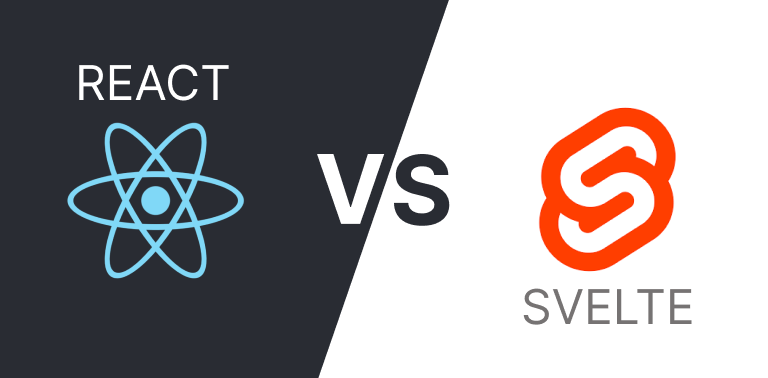

## Introduction

Svelte and React are both popular JavaScript frameworks for building user interfaces, each with its own set of strengths and weaknesses. Choosing between them can significantly impact your development experience and the performance of your applications. In this article, we will explore the pros and cons of Svelte and React to help you make an informed decision when selecting the right framework for your next project.

##  React: The Pros and Cons

### Pros of React:

#### 1. **Rich Ecosystem:**
   React boasts a vast ecosystem with numerous libraries, tools, and community-contributed components, enabling developers to find solutions for various requirements easily.

#### 2. **Component Reusability:**
   React's component-based architecture promotes reusability, making it efficient to develop complex applications by composing small, reusable components.

#### 3. **Strong Community Support:**
   React has a large and active community, providing extensive documentation, tutorials, and support. This community-driven approach ensures that developers can find help and resources readily.

#### 4. **Server-Side Rendering (SSR) and Static Site Generation (SSG):**
   React supports SSR and SSG, enabling developers to improve SEO, enhance performance, and provide a better user experience, especially for content-heavy applications.

#### 5. **React Native:**
   React's architecture extends to mobile app development through React Native, allowing developers to build cross-platform mobile applications using familiar React concepts.

### Cons of React:

#### 1. **Complexity and Boilerplate Code:**
   React applications often require more boilerplate code and additional libraries to handle state management and other functionalities, leading to increased complexity.

#### 2. **Performance Overhead:**
   React's virtual DOM reconciliation process, while efficient, introduces a performance overhead, especially in large and complex applications.

#### 3. **Steeper Learning Curve for Beginners:**
   React's ecosystem and the need to grasp concepts like JSX, state management, and component lifecycle can make the framework more challenging for beginners to learn.

## Svelte: The Pros and Cons

### Pros of Svelte:

#### 1. **Simplicity and Readability:**
   Svelte's syntax is clean and intuitive, making it easy to learn and read. It allows developers to focus on the logic and structure of their components without dealing with complex boilerplate code.

#### 2. **Faster Runtime Performance:**
   Svelte shifts the heavy lifting of framework code to compile time, resulting in smaller and faster runtime bundles. It optimizes the generated JavaScript code, leading to quicker loading times and improved performance for end-users.

#### 3. **No Virtual DOM:**
   Unlike React, Svelte does not use a virtual DOM. Instead, it updates the DOM directly when the state changes, reducing memory consumption and enhancing overall application performance.

#### 4. **Built-in Animation Support:**
   Svelte offers built-in support for animations, making it simpler to create smooth and interactive user interfaces without relying on additional libraries.

#### 5. **Scoped CSS:**
   Svelte's component-based architecture encapsulates styles within components, preventing global scope issues and making it easier to manage CSS.

### Cons of Svelte:

#### 1. **Smaller Ecosystem:**
   Svelte has a smaller ecosystem compared to React, which means there might be fewer third-party libraries and resources available for developers.

#### 2. **Learning Curve for Developers Familiar with React:**
   Developers transitioning from React might find it challenging to adjust to Svelte's different approach, although the learning curve is generally considered manageable.

## Conclusion

Choosing between Svelte and React depends on your specific project requirements, team expertise, and performance goals. Svelte offers simplicity, faster runtime performance, and a pleasant developer experience, especially for smaller applications and those focusing on speed and interactivity. React, with its rich ecosystem, component reusability, and strong community support, remains an excellent choice for large-scale applications, complex user interfaces, and projects requiring extensive third-party integrations.

Ultimately, both frameworks have their strengths and weaknesses. It's essential to evaluate your project needs and the preferences of your development team to make an informed decision. Whether you prioritize speed, simplicity, or a mature ecosystem, both Svelte and React have proven themselves as reliable choices for building modern web applications.